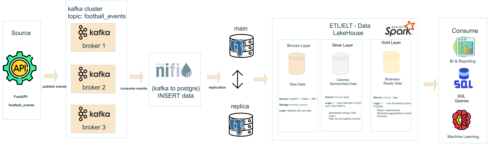

# ⚽ Football Live Streaming Data Pipeline

A real-time football event streaming pipeline showcasing modern data engineering, stream processing, and Medallion (Lakehouse) architecture.

FastAPI → Kafka (3 brokers) → NiFi → PostgreSQL (Master & Replica) → Spark (Bronze–Silver–Gold)
PySpark ETL orchestrated with Apache Airflow

# 📊 Architecture Overview

 

FastAPI simulates live football events

Kafka streams events at high throughput

NiFi consumes Kafka and writes raw events to PostgreSQL

PostgreSQL stores event logs and analytics tables

Spark (PySpark) processes data into Bronze, Silver, and Gold layers

Airflow schedules and monitors the Spark ETL job

# 🧱 Medallion Architecture

Bronze – Raw event capture from event_logs

Silver – Cleaned and deduplicated events

Gold – Aggregated team statistics (goals, fouls, shots)

🛠 Tech Stack

FastAPI · Kafka · NiFi · PostgreSQL · Spark · Airflow · Python · SQL

# ⏱ ETL & Orchestration

Raw events are first written to PostgreSQL event log tables

PySpark ETL transforms data across Bronze → Silver → Gold

Apache Airflow orchestrates and schedules the ETL pipeline

JDBC-based reads/writes ensure reliable batch processing

# 🎯 Purpose

A portfolio-grade project demonstrating:

Real-time streaming pipelines

Scalable data ingestion

Medallion architecture implementation

Spark + Airflow production patterns

Sports analytics use cases
