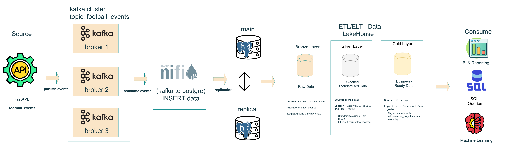

# football-live-streaming-data
A real-time football event streaming pipeline built to demonstrate modern data engineering and Lakehouse architecture patterns.

FastAPI → Kafka (3 brokers) → NiFi → PostgreSQL (Master & Replica) → Spark (Bronze–Silver–Gold)

🚀 Overview

FastAPI simulates live football match events

Kafka streams events at high throughput

NiFi ingests and loads data into PostgreSQL

PostgreSQL stores raw and replicated data

Spark processes data using the Medallion architecture

🛠 Tech Stack

FastAPI · Kafka · NiFi · PostgreSQL · Spark · Python · SQL

🎯 Purpose

A portfolio-grade project focused on real-time streaming, scalable pipelines, and sports analytics use cases.
